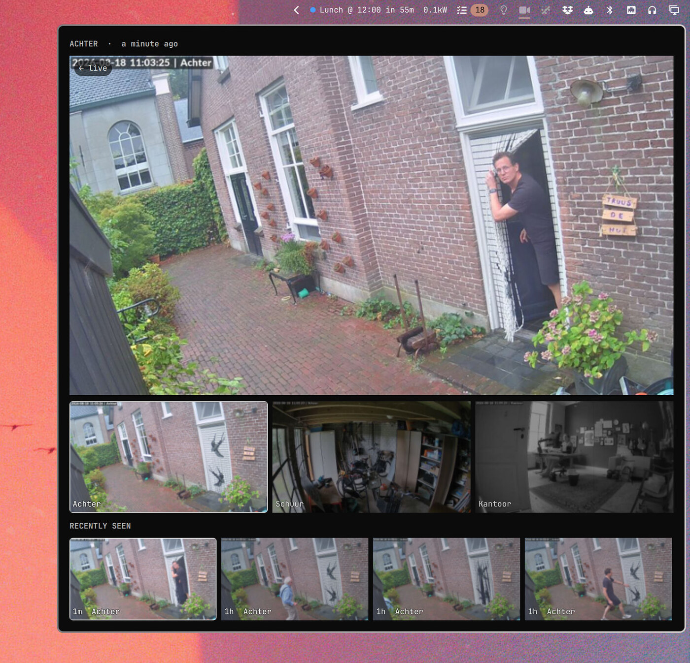

# UniFi Protect

An [Omarchy](https://omarchy.org) bar widget for [UniFi
Protect](https://ui.com/protect) cameras: one small icon in the bar, and the
pictures in a panel behind it.



The bar shows a camera glyph and nothing else. It lights up, and the name of
the camera slides in beside it, while Protect reports motion — so a camera
that sees something is noticeable out of the corner of your eye without a
video feed sitting in the bar all day.

Everything you would actually look at lives in the panel: the selected camera
large and playing live, the other cameras as thumbnails underneath, and below
those the frames your cameras filed the last time they saw something. Clicking
any picture opens that camera in Protect's own detection browser, which is
where you go when a glance is not enough.

## Install

```bash
omarchy plugin add https://github.com/jankeesvw/omarchy-unifi-protect.git --enable
```

Then give it a key and tell it where your console is — the two sections below.
The widget lands in the right section of the bar; move it with `omarchy bar
move`, or from the bar's own settings panel.

## The API key

Everything goes through Protect's integration API, which takes a plain
`X-API-KEY` header. Make a key at `https://<your-console>/unifi-api/protect`.

> ⚠️ UniFi hands a key the full rights of the account that created it, and
> there is no way to scope it down to Protect over the API. Make it on an
> account you are comfortable handing a shell widget, not on your own admin
> login.

The widget looks for the key in two places, in this order:

1. `UNIFI_API_KEY` in the environment.
2. A file, by default `~/.config/unifi-protect/api-key`. Set
   `UNIFI_API_KEY_FILE` to put it somewhere else.

The file is the one that works straight away, because a variable exported into
your session does not reach a shell that is already running:

```bash
mkdir -p ~/.config/unifi-protect
(umask 077; printf '%s\n' "paste-your-key-here" > ~/.config/unifi-protect/api-key)
```

The first line with something on it is the key, trimmed. Nothing else in the
file is parsed, and the widget never writes to it.

## Settings

All of it is configurable from the bar's settings panel, or by hand in the
widget's entry in `~/.config/omarchy/shell.json`:

| Setting | Default | What it does |
|---|---|---|
| `host` | `192.168.1.1` | The console running Protect — a UDM, a Cloud Key, whatever answers on your network. Address or hostname, no scheme. |
| `alertCameras` | *(empty)* | Camera names, comma separated, that may light the icon and file frames. Empty means all of them. |
| `notify` | `true` | Raise a desktop notification, with the frame in it, on motion. |
| `panelWidth` | `800` | Panel width in the shell's spacing units. Trimmed to fit a small screen. |
| `motionHoldMs` | `45000` | How long the icon stays lit after motion. |
| `refreshMs` | `1000` | How often the large view gets a fresh still while the stream is connecting. |
| `captureThrottleMs` | `25000` | How long a camera that just filed a frame files nothing more. |
| `archiveKeep` | `60` | Frames kept per camera. |
| `rtspPort` | `7447` | The plain RTSP port on the console. |
| `eventsUrl` | *(see below)* | Where clicking a picture takes you. |

`alertCameras` is worth setting. The camera aimed at your own desk reports
motion all day, and an icon that is always lit is an icon you stop reading:

```json
{ "id": "jankeesvw.unifi-protect", "host": "10.0.0.1", "alertCameras": "Front door, Shed" }
```

Names are matched against what Protect calls the cameras, ignoring case. The
setting gates the bar icon and the archive both; every camera stays visible in
the panel regardless.

`eventsUrl` is Protect's detection browser filtered to one camera. `{host}` is
the console and `{camera}` the camera id, and the default is:

```
https://{host}/protect/detections/find-anything?grade=all&labels=camera%3A{camera}&minConfidence=30
```

It is a setting rather than a constant because Protect is a single-page app:
that route cannot be read off the console, it was taken from the address bar,
and a UniFi update is free to move it.

## What it costs to run

The large view plays the camera's real RTSP stream, and only while the panel
is open. A stream left running behind a closed panel is a decoder and a few
megabits a second spent on a picture nobody is looking at.

The thumbnails stay stills, refreshed one camera at a time: three decoders
running so you can see which camera to click is a lot of CPU for a picture the
size of a stamp. A still is also what fills the large view for the second or
two the stream takes to connect, so opening the panel never starts on black.

With the panel closed, the widget holds one websocket open for motion events
and does nothing else. There is no polling.

## The archive

Every burst of motion on a camera you listed files one frame, whether or not
the panel happens to be open, in
`~/.local/state/unifi-protect/events/<camera-id>-<unix-time>.jpg`. The newest
four show up under the panel; clicking one puts it in the large view with how
long ago it was, and clicking it again goes back to live.

Frames are stored around 960px wide, so `archiveKeep` at its default of 60 per
camera is a few megabytes and covers a busy day. Protect keeps the actual
recordings; this is the shortcut that answers "was somebody at the door"
without opening anything.

## The command line

The widget shells out to `bin/unifi-protect` in this repo for everything, and
that script is usable on its own:

```bash
cd ~/.config/omarchy/plugins/jankeesvw.unifi-protect

./bin/unifi-protect list                  # cameras, as JSON
./bin/unifi-protect snapshot <camera-id>  # writes a JPEG, prints its path
./bin/unifi-protect events                # the archive, newest first
./bin/unifi-protect stream <camera-id>    # the RTSP url
./bin/unifi-protect live <camera-id>      # opens the stream in mpv
./bin/unifi-protect watch                 # motion as NDJSON, until killed
```

`--host`, `--rtsp-port` and `--archive-keep` go before the command. It is also
the first place to look when the bar icon stays dim: run `list` by hand and the
error comes back as JSON instead of disappearing into the shell's log.

To exercise the icon without waiting for somebody to walk past a camera:

```bash
omarchy-shell jankeesvw.unifi-protect.test motion "Front door"
omarchy-shell jankeesvw.unifi-protect.test clear
```

## Requirements

Omarchy with `omarchy-shell` (the Quickshell-based bar), and:

| | |
|---|---|
| `curl`, `jq` | talking to Protect |
| `python3` + [`websockets`](https://pypi.org/project/websockets/) | motion events. Without it everything works except the icon lighting up. |
| `imagemagick` | shrinking archived frames. Without it they are stored full size. |
| `libnotify` | the notification on motion |
| `mpv` | only for `unifi-protect live` |

On Arch:

```bash
sudo pacman -S --needed curl jq python python-websockets imagemagick libnotify mpv
```

Certificate checking is off for calls to the console: it serves a certificate
for its own hostname that no machine on your network has a chain for. This is
traffic to an address you typed yourself, on your own LAN. The live view also
reads the stream off the plain RTSP port rather than the encrypted one, because
Qt Multimedia gives no way to trust a self-signed certificate; `unifi-protect
live` keeps the encrypted URL, since mpv can be told to accept it.

## Remove

```bash
omarchy plugin remove jankeesvw.unifi-protect
```

The archived frames are yours, not the plugin's, so they stay in
`~/.local/state/unifi-protect/`. Delete that directory, and
`~/.config/unifi-protect/` with the key in it, if you want them gone too.

## License

MIT
